# Engagement / Audit Lifecycle — Workflow Diagram

**Status:** Session 1 draft. Reflects what's confirmed; TBD items marked.

**Legend:**
- 🟡 Yellow hexagons = confirmed approval gates
- 🔴 Red dashed = TBD / unconfirmed
- 🔵 Blue double-bracket = cross-workflow dependency
- Dotted `? →` = unconfirmed sequence
- Dotted `ongoing/parallel →` = concurrent activity

```mermaid
flowchart TD
    Start([Engagement kickoff]) --> P1_start
    
    subgraph P1 [" Phase 1 — Kickoff / Planning (blended) "]
        direction TB
        P1_start[Internal brainstorm] --> P1_scope[Scope definition]
        P1_scope --> P1_memo[Planning memo /<br/>audit program]
        P1_memo --> P1_budget[Budget & staffing]
        P1_budget --> P1_pbc[PBC list]
        P1_pbc --> G1{{Planning approval<br/>chain → PGA}}
        G1 --> P1_ann[Announcement memo drafted]
        P1_ann --> G2{{Announcement approval<br/>chain → PGA}}
        G2 --> P1_issue[Memo issued to auditee]
        P1_issue --> P1_kickoff[Entrance meeting]
    end
    
    P1_kickoff --> P2_start
    
    subgraph P2 [" Phase 2 — Fieldwork "]
        direction TB
        P2_start[Walkthroughs] --> P2_test[Control testing]
        P2_test --> P2_sample[Sample selection &<br/>evidence gathering]
        P2_sample --> P2_wp[Workpaper creation]
        P2_wp --> P2_review[Workpaper review<br/>1 level above last actor]
        P2_review --> P2_draft[Draft issue identification]
        P2_draft --> G3{{Fieldwork checklist<br/>TBD}}
        
        P2_it[Integrated team<br/>execution] -. parallel .-> P2_review
        P2_stat[Status meetings] -. ongoing .-> P2_review
        P2_hrs[Hours tracking] -. ongoing .-> P2_review
    end
    
    G3 --> P3_start
    
    subgraph P3 [" Phase 3 — Reporting (sequence TBD) "]
        direction TB
        P3_start[Finalize issues]
        P3_exit[Exit meeting]
        P3_mgmt[Management response]
        P3_draft[Draft report]
        P3_intrev[Internal review<br/>TL → AL → PGA → CAE]
        P3_rating[Report rating]
        G4{{Final approval<br/>per approval matrix}}
        P3_dist[Report distribution]
        P3_ac[Audit committee<br/>reporting if applicable]
        
        P3_start -. ? .-> P3_exit
        P3_exit -. ? .-> P3_mgmt
        P3_mgmt -. ? .-> P3_draft
        P3_draft --> P3_intrev --> P3_rating --> G4 --> P3_dist --> P3_ac
    end
    
    P3_ac --> P4_arch
    
    subgraph P4 [" Phase 4 — Closeout "]
        direction TB
        P4_arch[Workpaper archive] --> P4_recon[Hours & budget<br/>reconciliation]
        P4_recon --> P4_lessons[Lessons learned]
        P4_lessons --> P4_entity[Audit entity update]
        P4_entity --> P4_handoff[Issue handoff]
        P4_handoff --> P4_survey[Auditee survey]
        P4_survey --> P4_close[System close]
    end
    
    P4_close --> End([Engagement complete])
    P4_entity -.->|cross-workflow| EntitiesWF[[Audit Entities Workflow]]
    P4_handoff -.->|handoff| IssuesWF[[Issues Workflow]]
    
    classDef gate fill:#fef3c7,stroke:#f59e0b,stroke-width:2px
    classDef tbd fill:#fee2e2,stroke:#ef4444,stroke-dasharray:5 5
    classDef xwf fill:#dbeafe,stroke:#3b82f6,stroke-width:2px
    
    class G1,G2,G4 gate
    class G3 tbd
    class EntitiesWF,IssuesWF xwf
```

## Notes

- **Phase 3 sequencing** is shown with `?` connectors — needs confirmation.
- **Phase 2 exit gate** (Fieldwork checklist) is marked TBD — contents to be retrieved.
- **Cross-workflow connections** from Closeout are shown but the mechanism in Optro is a gap-analysis item.
- This is a **role-agnostic flow view**. A swimlane version (roles as swimlanes) can be added when RACI is finalized.
